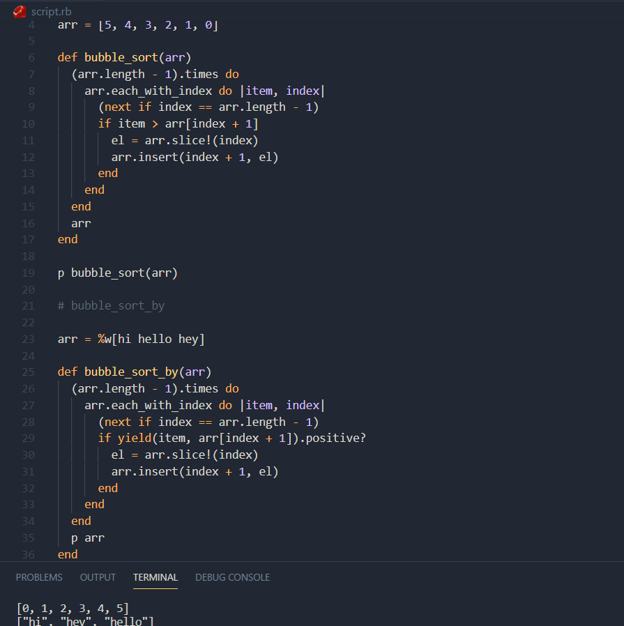

# Bubble Sort

> Simple sorting algorithm built using Ruby.

## Built With

- Ruby

## Getting Started

You should have Ruby installed to run this.

## Authors

👤 **Gabriel Suárez**

- Github: [@ginnandjuice](https://github.com/ginnandjuice)
- Twitter: [@fatbaxxter](https://twitter.com/fatbaxxter)
- Linkedin: [Gabriel Suárez](https://www.linkedin.com/in/gabriel-su%C3%A1rez-torres-85125a1ab/)

👤 **karmaester**

- Github: [@githubhandle](https://github.com/karmaester)
- Twitter: [@twitterhandle](https://twitter.com/karmaendlich)
- Linkedin: [linkedin](https://www.linkedin.com/in/khristian-rojas/)

## 🤝 Contributing

Contributions, issues, and feature requests are welcome!

Feel free to check the [issues page](https://github.com/karmaester/Bubble-Sort-with-Ruby/issues).

## Show your support

Give a ⭐️ if you like this project!

## Acknowledgments

-Bubble Sort is a simple sorting algorithm
Read about it here: https://en.wikipedia.org/wiki/Bubble_sort

## 📝 License

This project is [MIT](lic.url) licensed.
